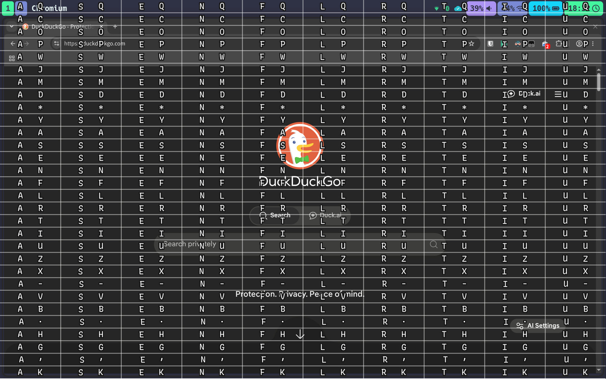

# Nomooz
A mouse replacement for Niri (and other wlroots compositors)



## How to compile it

You need a Rust toolchain installed. Then:
```sh
cargo build --release
```

The binary will be at `target/release/nomooz`.

## How to use it

### Compositor configuration
Add a binding in your compositor config (example for `niri`):

```kdl
Mod+M hotkey-overlay-title="Launch nomooz (keyboard mouse overlay)" { spawn "~/path_to/nomooz"; }
```

### How does it work?

Launching the binary shows a grid over your active display.

#### Select a cell

Each cell is labeled with its shortcut. To select the cell labeled "f y", press "f" then "y".

#### Pick a division

After selecting a cell, press a third key (same 3-row layout, now shown smaller inside the cell) to pick a division and click there immediately.

Hold `Shift` while pressing that key to pick the division without clicking, so you can refine it further (shrink, move) before producing the click.

If you skip this step and just press a click key right away, it clicks the center of the cell (marked with a small square).

#### Refine the selection

- Arrow keys (or Vim direction keys) move the selection by its own size.
- The dedicated “shrink” key (converging arrows on the diagram) halves the selection, centered. Repeat to keep narrowing it down to a single pixel.
- The “cancel” key reverts the last step (move, shrink, or cell selection). Can be used repeatedly.

#### Produce a click

- Pressing a click key (left/middle/right) clicks at the center of the current selection
- Press the same click key twice quickly for a double click (single selection only)
- Click keys and other shortcuts are configurable — see [Keybindings](#keybindings)

#### Selection and drag’n drop

After a first selection, press the “next selection” key to start a second one, then click. This holds the button down and moves the pointer between the two selections.

#### Work with multiple displays

`Shift` + arrow (or Vim direction) switches the active display.

## Configuration

On first run, nomooz creates a default config file at `$XDG_CONFIG_HOME/nomooz/config.kdl`
(or `~/.config/nomooz/config.kdl` if `XDG_CONFIG_HOME` is unset), using [KDL](https://kdl.dev)
syntax. Edit it to customize the appearance:

```kdl
appearance {
  font "Roboto"
  text-color "#ffffffff"
  text-background-color "#1a1a1aff"
  grid-cells-color "#ffffff20"
  grid-lines-color "#000000a0"
  background-color "#000000a0"
}
```

- `font`: font family name, resolved via fontconfig
- `text-color` / `text-background-color`: label text and the disc behind it
- `grid-cells-color` / `grid-lines-color`: selection grid cells and their borders
- `background-color`: overall screen dimming

Colors are `#rrggbbaa` hex strings.

### Keybindings

```kdl
binds {
  left-click space
  middle-click 8
  right-click 9
  next-selection Return
  cancel-selection BackSpace
}
```

Key names are [xkbcommon keysym names](https://xkbcommon.org/doc/current/xkbcommon-keysyms_8h.html) (case-insensitive), e.g. `space`, `Return`, `BackSpace`, or a single character/digit like `8`.

- `left-click` / `middle-click` / `right-click`: produce a click
- `next-selection`: start a second selection for drag'n drop
- `cancel-selection`: revert the last selection step

## Niri configuration recommendation

If you’re using niri with `focus-follows-mouse` enabled, add `max-scroll-amount="0%"` to avoid unwanted view scrolling when the synthetic pointer passes over a window that’s only partially on screen:

```kdl
input {
    focus-follows-mouse max-scroll-amount="0%"
}
```

Without it, niri scrolls the view to bring such a window fully into view as soon as the pointer touches it (this also happens with a real mouse — it’s normal niri behavior, just disruptive when this tool moves the pointer around).

## Resources

This Smithay’s Toolkit example was the starting point:
https://github.com/Smithay/client-toolkit/blob/master/examples/simple_layer.rs

Protocol specifications and Rust bindings used by this project:

- [wlr-protocols](https://gitlab.freedesktop.org/wlroots/wlr-protocols): official wlroots Wayland protocol extensions, including:
  - `wlr-layer-shell-unstable-v1`: the fullscreen overlay surface
  - `wlr-virtual-pointer-unstable-v1`: the synthetic click and pointer motion
- [smithay-client-toolkit](https://github.com/smithay/client-toolkit) ([docs](https://smithay.github.io/client-toolkit)): Rust client toolkit for Wayland, handles the surface/seat/output boilerplate
- [wayland-protocols-wlr](https://docs.rs/wayland-protocols-wlr/): Rust bindings for the wlr-protocols extensions above
- [xkbcommon-rs](https://docs.rs/xkbcommon-rs/): keymap parsing, used to display the right character on each key regardless of keyboard layout

## License

Licensed under either of [Apache License, Version 2.0](./LICENSE-APACHE) or
[MIT license](./LICENSE-MIT) at your option.
