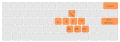

# Nomooz
A mouse replacement for Niri (and other wlroots compositors)


## How to compile it

You need a Rust toolchain installed. Then:
```sh
cargo build --release
```

The binary will be at `target/release/nomooz`.

## How to use it

### Compositor configuration
Add a binding in your compositor config (example for `niri`):

```kdl
Mod+M hotkey-overlay-title="Launch nomooz (keyboard mouse overlay)" { spawn "~/path_to/nomooz"; }
```

### How does it work?

Launching the binary shows a grid over your active display.

#### Select a grid cell

Each cell is labeled with its shortcut. To select the cell labeled "f y", press "f" then "y".

#### Select a more precise location

Once a cell is selected, use the arrow keys (or Vim direction keys) to shrink the selection: each press halves it in the given direction.

#### Cancel last selection step

`Backspace` reverts the last selection step. Can be used repeatedly.

#### Produce a click

- `Space`: left click at the center of the current selection
- The three bottom-row keys to the right of space (physical position, independent of your keyboard layout): left, middle, right click
- Press the same click key twice quickly for a double click (single selection only)



#### Selection and drag’n drop

After a first selection, press `Enter` to start a second one, then click. This holds the button down and moves the pointer between the two selections.

#### Work with multiple displays

`Shift` + arrow (or Vim direction) switches the active display.

## Niri configuration recommendation

If you’re using niri with `focus-follows-mouse` enabled, add `max-scroll-amount="0%"` to avoid unwanted view scrolling when the synthetic pointer passes over a window that’s only partially on screen:

```kdl
input {
    focus-follows-mouse max-scroll-amount="0%"
}
```

Without it, niri scrolls the view to bring such a window fully into view as soon as the pointer touches it (this also happens with a real mouse — it’s normal niri behavior, just disruptive when this tool moves the pointer around).

## Resources

This Smithay’s Toolkit example was the starting point:
https://github.com/Smithay/client-toolkit/blob/master/examples/simple_layer.rs

Protocol specifications and Rust bindings used by this project:

- [wlr-protocols](https://gitlab.freedesktop.org/wlroots/wlr-protocols): official wlroots Wayland protocol extensions, including:
  - `wlr-layer-shell-unstable-v1`: the fullscreen overlay surface
  - `wlr-virtual-pointer-unstable-v1`: the synthetic click and pointer motion
- [smithay-client-toolkit](https://github.com/smithay/client-toolkit) ([docs](https://smithay.github.io/client-toolkit)): Rust client toolkit for Wayland, handles the surface/seat/output boilerplate
- [wayland-protocols-wlr](https://docs.rs/wayland-protocols-wlr/): Rust bindings for the wlr-protocols extensions above
- [xkbcommon-rs](https://docs.rs/xkbcommon-rs/): keymap parsing, used to display the right character on each key regardless of keyboard layout

## License

Licensed under either of [Apache License, Version 2.0](./LICENSE-APACHE) or
[MIT license](./LICENSE-MIT) at your option.
